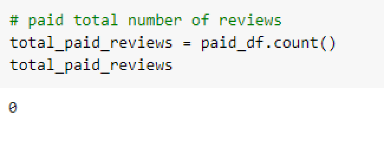
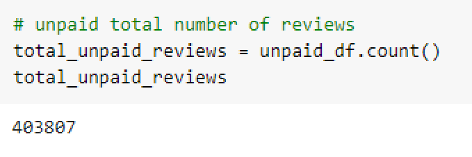
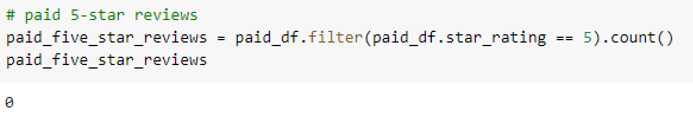
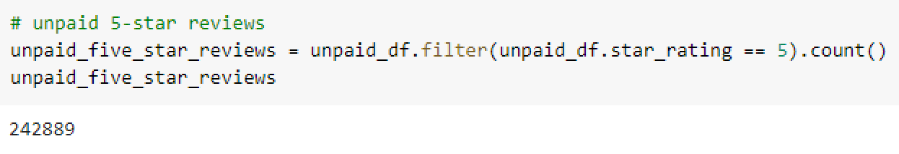
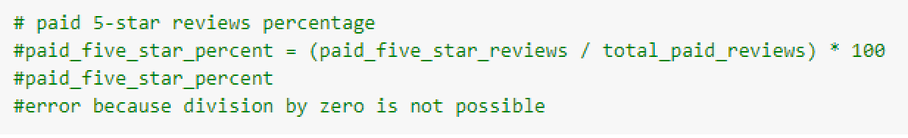
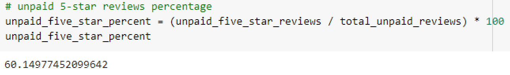

# Amazon_Vine_Analysis - Challenge 16

## Overview of the analysis
The purpose is to analyze the reviews written by the members of the Amazon paid Vine program. The purpose of the program is for manufacturers and publishers to get reviews by providing products to the Vine members. After the Amazon Vine Member uses the product, they are required to publish a review. 

For the analysis, I selected the Books data set which included reviews for specific books. The analysis was done by using PySpark to perform ETL, connecting to an AWS RDS instance, and then loading the data into pgAdmin. I also used PySpark to perform analysis to check if there was any bias from the Vine reviews. 

## Results: Using bulleted lists and images of DataFrames as support, address the following questions:

1. How many Vine reviews and non-Vine reviews were there?
* Vine reviews: 0

* non-Vine reviews: 403,807

2. How many Vine reviews were 5 stars? How many non-Vine reviews were 5 stars?
* 5 star Vine reviews: 0

* 5 star non-Vine reviews: 15,663

3. What percentage of Vine reviews were 5 stars? What percentage of non-Vine reviews were 5 stars?
* % Vine 5 star reviews: 0%

* % non-Vine 5 star reviews: 60%

## Summary
Based on the findings, manufacturers and companies are not using the Vine program for book reviews. There are 0 reviews from the vine program in the books data set. Therefore, there is no bias towards the book reviews because of the Amazon Vine Program. 
